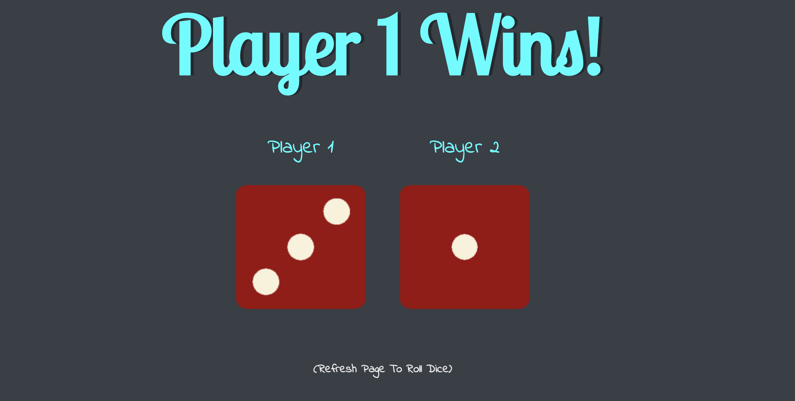
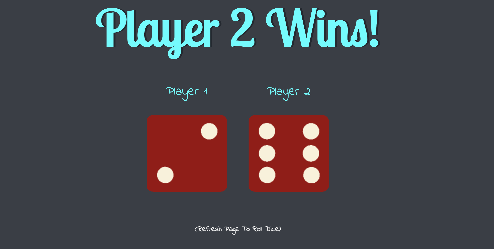
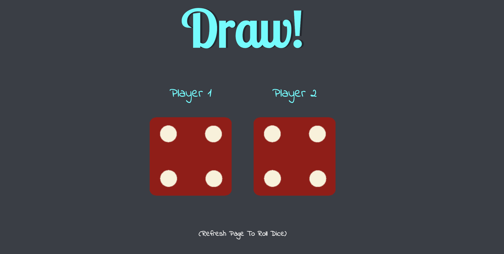

<h1>Dice Game</h1>

This is a simple dice game focusing on JavaScript and DOM manipulation. 

The rules are simple, the player that rolls the higher dice number wins or if both dice are equal then its a draw.

Roll the dice by refreshing the webpage. Each time the page is refreshed the dice will roll again.

